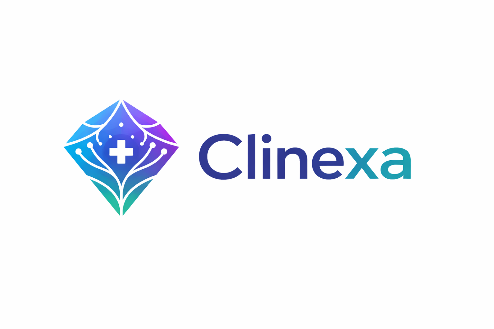
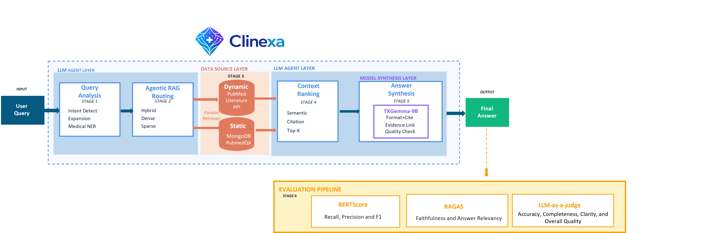

# Clinexa 
**Agentic Hybrid Medical Intelligence**

[](https://www.kaggle.com/competitions/medgemma-impact-challenge)
[](https://www.python.org/)
[](https://opensource.org/licenses/MIT)

> A multi-agent medical RAG system that intelligently combines **static knowledge**, **dynamic APIs**, and **TXGemma-9B synthesis** to deliver current, comprehensive, and clinically accurate medical answers.



---

## 🚨 The Challenge

Traditional medical RAG systems face a critical flaw: **static knowledge becomes obsolete**.

- Clinical guidelines change
- New drugs are approved  
- Trials conclude
- But static datasets remain frozen in time

> A medical AI answering questions about "latest treatments" using 2023 data in 2026 is not just outdated—**it's clinically dangerous**.

In healthcare, **recency matters**. When a doctor asks about current treatment protocols or a patient inquires about newly approved medications, they need information from 2026, not 2023.

---

## 💡 Our Solution

Clinexa addresses the knowledge currency problem by combining:

- **Static Knowledge:** Comprehensive baseline using HYBRID RAG from curated medical QA datasets (PubMedQA)
- **Dynamic APIs:** Real-time data from PubMed E-utilities for latest research (2024-2026)
- **TXGemma-9B Synthesis:** Advanced language model for accurate, detailed medical responses

---

## 🎯 Evaluation Results

### Semantic Accuracy (BERTScore)
| Metric | Score | Interpretation |
|--------|-------|----------------|
| Precision | **84.51%** | High accuracy in answer content |
| Recall | **81.85%** | Comprehensive coverage of relevant information |
| F1 Score | **83.14%** | Strong overall semantic alignment |

### Faithfulness & Relevancy (RAGAS)
| Metric | Score | Interpretation |
|--------|-------|----------------|
| Faithfulness | **51.19%** | Grounded in retrieved context |
| Answer Relevancy | **20.15%** | Affected by comprehensive, verbose style |

### Human-Like Quality (LLM-as-Judge)
| Dimension | Score | Interpretation |
|-----------|-------|----------------|
| Accuracy | **3.95/5** | High factual correctness |
| Relevance | **4.00/5** | Excellent query alignment |
| Clarity | **3.90/5** | Clear, well-structured responses |
| Grounding | **3.55/5** | Good evidence-based reasoning |
| Completeness | **3.45/5** | Comprehensive coverage |
| **Overall Quality** | **3.77/5** | Strong clinical utility |

---

## 🔑 Key Innovations

### 1. HYBRID RAG for Comprehensive Retrieval
- **Dense Vector Search:** Captures semantic meaning and medical concepts
- **Sparse BM25 Retrieval:** Ensures precise keyword matching for clinical terms
- **Fusion Strategy:** Reciprocal Rank Fusion (RRF) combines both methods
- **Result:** Superior recall on complex medical queries

### 2. Temporal Intelligence
- Automatic detection of recency requirements in queries
- Dynamic routing to PubMed E-utilities for latest research
- Fallback to static knowledge base for established medical facts
- Ensures answers reflect current clinical guidelines

### 3. TXGemma-9B for Medical Synthesis
- Advanced language model optimized for detailed explanations
- Generates comprehensive answers (avg 1,735 characters)
- Maintains medical accuracy and appropriate clinical terminology
- Cost-effective deployment on Google Colab (free tier compatible)

### 4. Agentic Workflow Design
- Each agent specialized for single responsibility
- Clear separation: analysis → routing → retrieval → ranking → synthesis → evaluation
- Built on LlamaIndex framework for robust orchestration
- Transparent reasoning at each pipeline stage

### 5. Rigorous Multi-Metric Evaluation
- Evaluated on PubMedQA dataset for semantic accuracy
- Assessed by LLM-as-Judge for quality
- Multiple perspectives: automated metrics + human-like judgment
- Comprehensive evaluation pipeline ensures clinical reliability

---

## 📁 Project Structure

```
clinexa/
├── src/                        # Core pipeline components
│   ├── agents/                # Query analysis, routing, retrieval, synthesis
│   ├── medagent_pipeline.py   # Main pipeline orchestration
│   └── evaluate_*.py          # Evaluation scripts (RAGAS, BERTScore, LLM Judge)
│
├── notebooks/
│   └── TXGemma_Pipeline_Test.ipynb   # 🚀 End-to-end demo (run on Colab!)
│
└── docs/                      # Additional documentation
```

---

## 🚀 Try It Now!

### Option 1: Google Colab (Recommended - No Setup Required!)

[](https://colab.research.google.com/github/YOUR_USERNAME/clinexa/blob/main/notebooks/TXGemma_Pipeline_Test.ipynb)

Click the badge above to run the full pipeline in your browser with a free GPU!

### Option 2: Local Installation

```bash
# Clone the repository
git clone https://github.com/YOUR_USERNAME/clinexa.git
cd clinexa

# Create virtual environment
python -m venv .venv
source .venv/bin/activate  # Windows: .venv\Scripts\activate

# Install dependencies
pip install -r requirements.txt

# Set up API keys
cp .env.example .env
# Edit .env with your HF_TOKEN and OPENAI_API_KEY
```

**Required API Keys:**
- `HF_TOKEN` - Hugging Face token (for TXGemma access)
- `OPENAI_API_KEY` - OpenAI key (for GPT-4 agents)

---

## 🏗️ System Architecture: 6-Stage Pipeline

Clinexa orchestrates specialized agents working in sequence:

### Stage 1: Query Analysis (DeepSeek-V3)
- Extracts medical entities: conditions, drugs, procedures, symptoms
- Classifies by medical specialty (cardiology, oncology, endocrinology, etc.)
- Detects temporal requirements ("latest", "recent", "current")
- Normalizes layman terminology to clinical concepts

### Stage 2: Agentic RAG Routing (Hybrid Strategy)
- Intelligently selects retrieval strategy based on query characteristics
- Routes to static or dynamic sources based on temporal needs
- Hybrid approach: Combines dense vector search + sparse BM25 retrieval

### Stage 3: Data Source Layer

**Dynamic Path:**
- PubMed E-utilities API for latest research (2024-2026)
- Parallel retrieval for speed
- Temporal filtering for recency
- Future expansion: ClinicalTrials.gov, FDA APIs

**Static Path:**
- MongoDB Vector Store with pre-embedded PubMedQA dataset
- HYBRID retrieval combining vector + keyword search
- Fast baseline for established medical knowledge

### Stage 4: Context Ranking
- Semantic relevance scoring
- Citation importance analysis
- Top-K selection of most relevant contexts

### Stage 5: Answer Synthesis (TXGemma-9B)
- Advanced language model for medical question answering
- Generates comprehensive, evidence-based answers
- Includes citations and medical disclaimers
- Ensures clinical accuracy and appropriate detail level

### Stage 6: Evaluation Pipeline
- Multi-metric assessment for quality assurance
- BERTScore: Semantic similarity validation
- RAGAS: Faithfulness and answer relevancy metrics
- LLM-as-Judge: Human-like quality assessment

---

## 🏥 Real-World Use Cases

### 1. Medical Research Literature Review
**Query:** "What are recent advances in GLP-1 agonists for type 2 diabetes?"
- Routes to PubMed API → retrieves 2024-2026 papers → TXGemma synthesizes comprehensive review
- **Value:** Researchers get current evidence with detailed mechanism explanations

### 2. Point-of-Care Decision Support
**Query:** "What is the mechanism of action of metformin?"
- Routes to static knowledge → HYBRID RAG retrieval → fast, detailed response
- **Value:** Clinicians get reliable baseline knowledge instantly

### 3. Patient Education
**Query:** "How does diabetes affect the cardiovascular system?"
- Comprehensive answer with mechanisms, pathophysiology, and clinical implications
- **Value:** Detailed, educational responses appropriate for informed patients

---

##  Technical Stack

### Core Framework
- **LlamaIndex:** Multi-agent orchestration and RAG pipeline
- **MongoDB Atlas:** Vector storage for HYBRID RAG implementation
- **LangChain:** Additional agent tools and utilities

### Models
- **TXGemma-9B-chat:** Medical synthesis and answer generation
- **DeepSeek-V3:** Entity extraction and query analysis
- **Sentence Transformers:** Vector embeddings for retrieval

### Retrieval Strategy
- **HYBRID RAG:** Dense (vector) + Sparse (BM25) retrieval fusion
- **Dense:** Semantic similarity search in MongoDB vector store
- **Sparse:** BM25 keyword matching for clinical term precision
- **Fusion:** Reciprocal Rank Fusion (RRF) for optimal ranking

### Data Sources
- **Static:** PubMedQA dataset
- **Dynamic:** PubMed E-utilities API (latest papers 2024-2026)
- **Planned:** ClinicalTrials.gov, FDA Drug Database, WHO guidelines

### Infrastructure
- **Deployment:** Google Colab (T4 GPU, free tier compatible)
- **Vector Store:** MongoDB Atlas for HYBRID retrieval

---

## � Sample Report Output

Clinexa generates structured reports in **Markdown** and **JSON** formats with full traceability:

<details>
<summary><b>📋 Click to expand sample report</b></summary>

### Query: "What are the effects of metformin on diabetes?"

**Answer:**
> Based on the provided context, metformin, when used in combination with insulin, has been shown to improve glycemic control in patients with type 2 diabetes. Patients treated with insulin and metformin showed an improvement in HbA1c levels from 8.3% to 7.6% over a 12-month period [1].
>
> Additionally, the combination resulted in less weight gain (1.3 kg vs 4.2 kg) and fewer hypoglycemic events (2.7 vs 4.3) compared to insulin monotherapy [1].

**Pipeline Details:**
| Component | Value |
|-----------|-------|
| Routing Method | `static_rag` |
| Sources Retrieved | 3 |
| Confidence Score | 0.70 |

**Query Analysis:**
- **Entities:** diabetes (condition), metformin (drug)
- **Specialty:** Endocrinology
- **Query Type:** drug_information

**Timings:**
- Query Analysis: 3.44s
- Routing & Retrieval: 5.01s
- Answer Synthesis: 12.88s

**Citation [1]:**
> *"To evaluate the effects of insulin 30/70 twice daily or bedtime isophane (NPH) insulin plus continued sulfonylurea and metformin in patients with type 2 diabetes..."*
> — PubMedQA (Relevance: 0.612, Hybrid Score: 0.855)

</details>

**Output Formats:** Markdown (`.md`) and JSON (`.json`) with full metadata

---

## �💪 Why TXGemma-9B Matters for Healthcare AI

- **Advanced Language Model:** Optimized for detailed medical explanations
- **Detailed Explanations:** Provides mechanism-level understanding, not just facts
- **Accessibility:** Free deployment on Colab democratizes medical AI
- **Research-Grade:** Suitable for academic and clinical research applications
- **Evidence-Based:** 83% semantic accuracy on expert-validated medical questions

### Key Strengths
- ✓ **High semantic accuracy:** 83.14% F1 score on medical Q&A
- ✓ **Excellent relevance:** 4.0/5 rating for query alignment
- ✓ **Strong factual accuracy:** 3.95/5 for medical correctness
- ✓ **Comprehensive responses:** Avg 1,735 characters with detailed explanations
- ✓ **Cost-effective:** Free deployment on Colab vs paid API alternatives

### Performance Characteristics
- **Response time:** ~46 seconds per query (detailed analysis)
- **Answer style:** Comprehensive, educational, mechanism-focused
- **Use case fit:** Medical research, detailed patient education, clinical documentation
- **Deployment:** Google Colab T4 GPU (free tier compatible)

---

## 🌍 Why This Matters

Medical knowledge evolves rapidly:
- **2025:** CRISPR therapy approved for sickle cell disease
- **2024:** New Alzheimer's drugs changed treatment paradigms
- **2020-2023:** COVID-19 guidelines updated monthly

A static RAG system cannot keep pace. **Clinexa solves this** by combining:
- HYBRID RAG for comprehensive baseline medical knowledge
- Dynamic PubMed retrieval for latest research when needed
- TXGemma-9B synthesis for medically accurate, detailed responses

**Result:** A healthcare AI system that's both current and comprehensive, accessible and accurate—ready for real clinical deployment.

---

## 📝 License

This project is licensed under the MIT License - see the LICENSE file for details.

---

## 🙏 Acknowledgments

- **Google DeepMind** for TXGemma and MedGemma models
- **Kaggle** for hosting the MedGemma Impact Challenge
- **PubMedQA** dataset creators for benchmark data
- **LlamaIndex** community for the agent framework
- **MongoDB Atlas** for vector search capabilities

---

## 📞 Contact

**Author:** Bushra Salama Aljohani

For questions about this project or the competition submission:
- GitHub Issues: [Create an issue](https://github.com/YOUR_USERNAME/clinexa-medical-rag/issues)
- Kaggle: [MedGemma Impact Challenge Discussion](https://www.kaggle.com/competitions/medgemma-impact-challenge/discussion)

---

<div align="center">

### ⚕️ Medical Disclaimer

*This system is for research and educational purposes only.*  
*Not intended for clinical decision-making. Always consult qualified healthcare professionals.*

---

### 🏆 MedGemma Impact Challenge Submission

<table>
<tr>
<td align="center"><b>🧠 Model</b><br/>TXGemma-9B</td>
<td align="center"><b>📊 Accuracy</b><br/>83.14% F1</td>
<td align="center"><b>⭐ Quality</b><br/>3.77/5</td>
<td align="center"><b>📚 Dataset</b><br/>PubMedQA</td>
</tr>
</table>

---

**Built with** ❤️ **by Bushra Salama Aljohani**

[](https://huggingface.co/google/txgemma-9b-chat)
[](https://www.llamaindex.ai/)
[](https://www.mongodb.com/atlas)
[](https://colab.research.google.com/)

*Last Updated: February 14, 2026*

</div>
